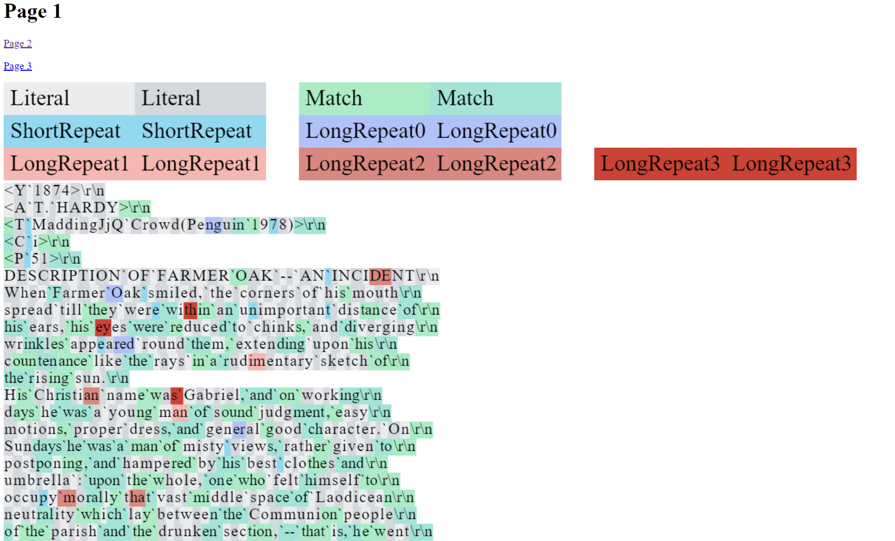

# LZMA Markup

**This project created to visualize LZMA compression.**

It has different render modes to emphasize how compressed files are splitted in LZMA packets as well as how entropy heatmap looks like.

Not only text files but executables or any other files could be visualized as all characters forced to have text representation. Hexadecimal mode is also supported.

Input files are splitted into html pages, each page renders image canvas. So markup should not lag in browser. You can see markup for as large files as you want, as long as you have enough memory on your hard drive.

Colors, render mode and other parameters taken to settings file, so you dont have to recompile code each time.

#### Content
- Code and VS2019 project files are available in .\code\LZMAMarkup\
- Executables are available in .\exe\
- .\exe\README.md contains descriptions of parameters for programs
- Examples of program usage are in .\examples\\* folders. Each folder have different parameters or compressed file. Each folder also have screenshot of markup. Markup in .\examples\test_default\html is already generated.
- .\examples\REAMDE.md contains description of file with parameters (Settings.txt)
- In case you want to change font, you may want to use .\code\ChractersSizeGenerator\main.cpp or corresponding executable

