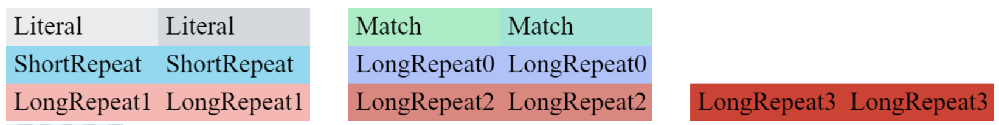
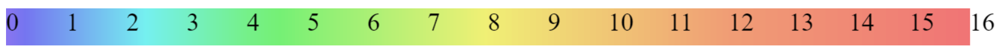

### Settings.txt file description:
- **renderType**: could be "general" or "hexadecimal". First option is better for text files, second is fixed-width and better for executables. "general" renders visible characters as usual, but uses codes like "\176" or "\n" for other characters. "hexadecimal" renders each character as two hex digits.

- **renderMode**: could be "blocks" or "entropy". First option uses different background colors for different LZMA packets. Second uses background color to show how many bits were used to encode character.

- **textFont**: e. g. "24px_Arial_Bold" (you need to replace space with _ character). Font should correspond to "CharSizeConsole.log" file.

- **maxCharactersPerLine**: how many characters may be in one line. Smaller number forces smaller and more lag-friendly html pages, but will lead to bigger number of pages.

- **maxLinesPerPage**: how many lines per page. Smaller number forces smaller and more lag-friendly html pages, but will lead to bigger number of pages.

- **ignoreEndLine**: could be "0" or "1". If "0", new line starts when "\n" is found or when **maxCharactersPerLine** is reached. If "1", new line starts only when **maxCharactersPerLine** is reached.

- **horisontalBlockShiftLeft**, **horisontalBlockShiftRight**: spacing to make each rendered block wider than font width. In pixels multiplied by 10.

- **verticalBlockShiftUp**, **verticalBlockShiftDown**: spacing to make each rendered block higher than font height. In pixels.

- **literalColorFirst**, **literalColorSecond**, **matchColorFirst**, **matchColorSecond**, **shortRepeatColorFirst**, **shortRepeatColorSecond**, **longRepeat0ColorFirst**, **longRepeat0ColorSecond**, **longRepeat1ColorFirst**, **longRepeat1ColorSecond**, **longRepeat2ColorFirst**, **longRepeat2ColorSecond**, **longRepeat3ColorFirst**, **longRepeat3ColorSecond**: color of each packet of LZMA for "blocks" **renderMode**. Each packet have 2 colors to make consecutive blocks of same packet separatable.

- **textColor**: e. g. "black".

- **entropySaturation**, **entropyLightness**: HSV second and third parameters for "entropy" **renderMode**.

